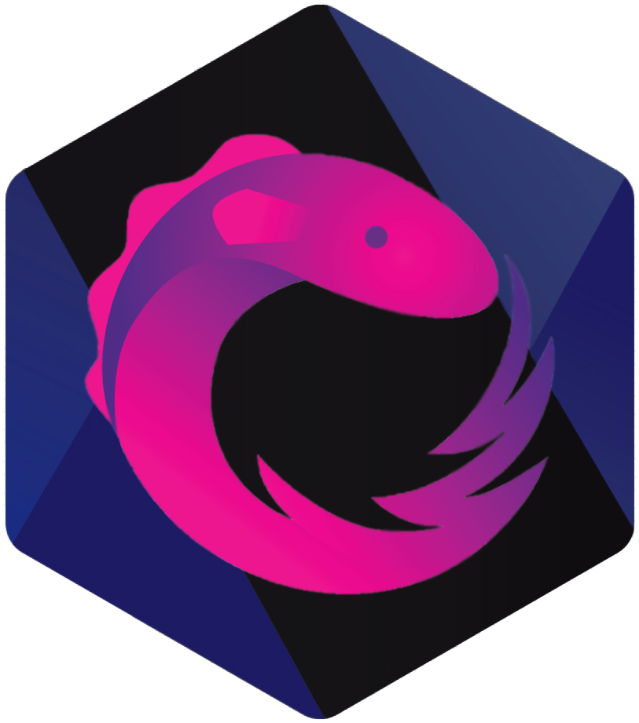

# @derxjs/view-model

<p align="center">
    
</p>

## Installation

```bash
npm i @derxjs/view-model
```

## Usage

```ts
import { DeRxJSViewModel } from "@derxjs/view-model";
import { merge, Observable } from "rxjs";
import { map, scan, startWith } from "rxjs/operators";

export const listViewModel$: DeRxJSViewModel<
  ListViewModelInputs,
  ListViewModel
> = ({ push$, pop$, initialValue }) => {
  return merge(
    push$.pipe(map((item) => ({ type: "push", item }))),
    pop$.pipe(map(() => ({ type: "pop" })))
  ).pipe(scan(reducer, initialValue), startWith(initialValue));
};

interface ListViewModelInputs {
  push$: Observable<string>;
  pop$: Observable<void>;
  initialValue: string[];
}

type ListViewModel = string[];

type Action = { type: "push"; item: string } | { type: "pop" };

function reducer(state: ListViewModel, action: Action): ListViewModel {
  switch (action.type) {
    case "push": {
      return [...state, action.item];
    }
    case "pop": {
      const newState = [...state];
      newState.pop();
      return newState;
    }
  }
}
```

See it in action on [StackBlitz](https://stackblitz.com/edit/typescript-ttcedi?embed=1&file=index.ts)

## @derxjs Roadmap

- @derxjs/view-model package ✅
- Article on TDD and implementing DeRxJS View Models (10/8/2021)
- Article on using DeRxJS View Models in different Frameworks (10/15/2021)
- @derxjs/reducer package (TBD)
- Timeline Test Code Generation Tool (TBD)
- @derxjs/selector package (TBD)
- @derxjs/react package (TBD)
- Ai-Driven Code DeRxJS Code Generation (TBD)
